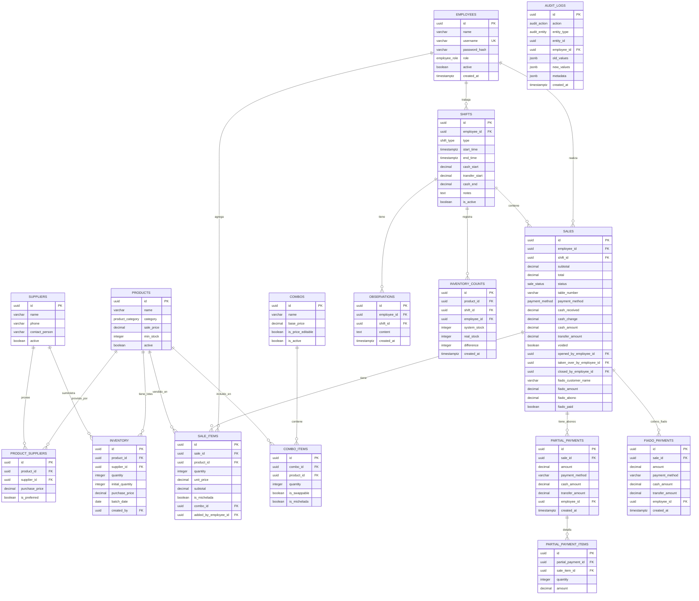
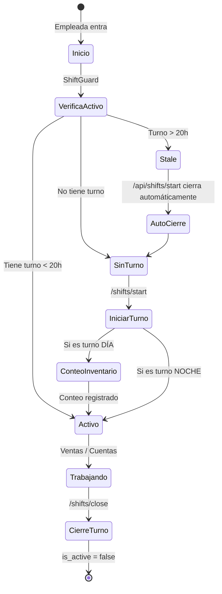
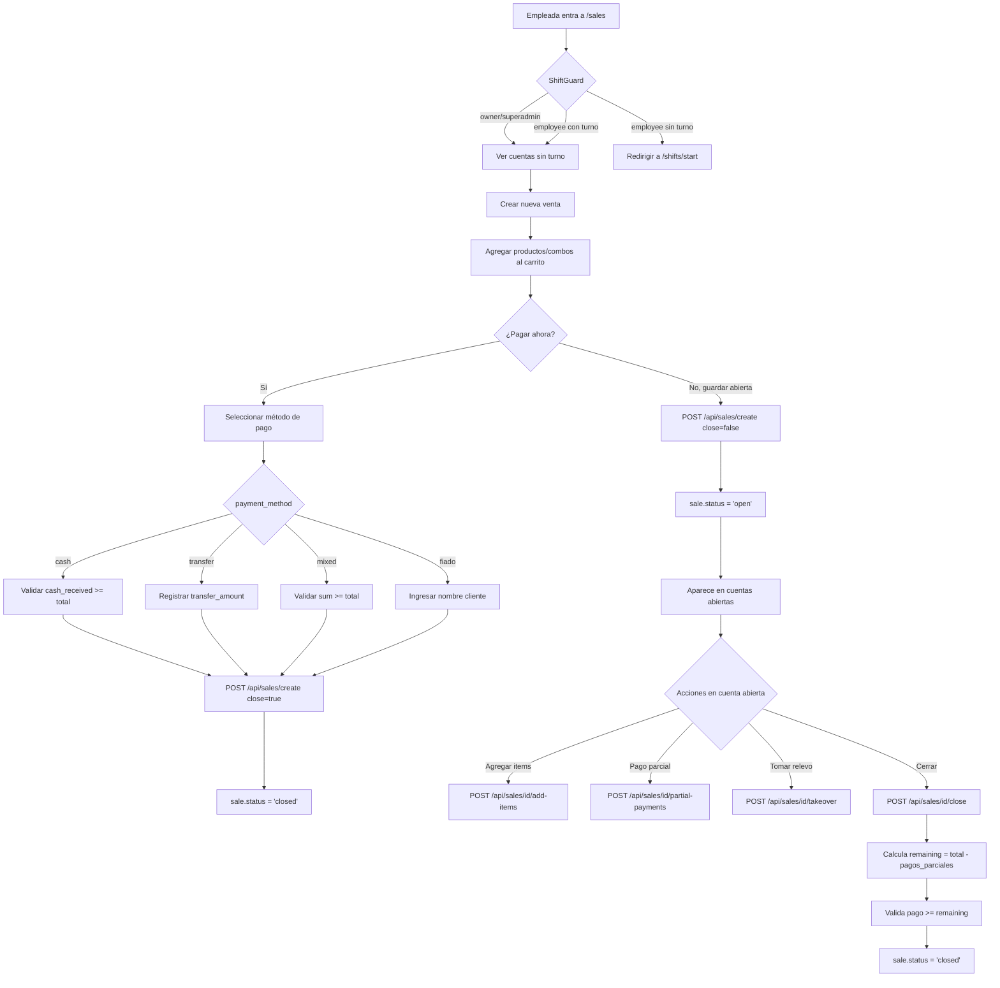
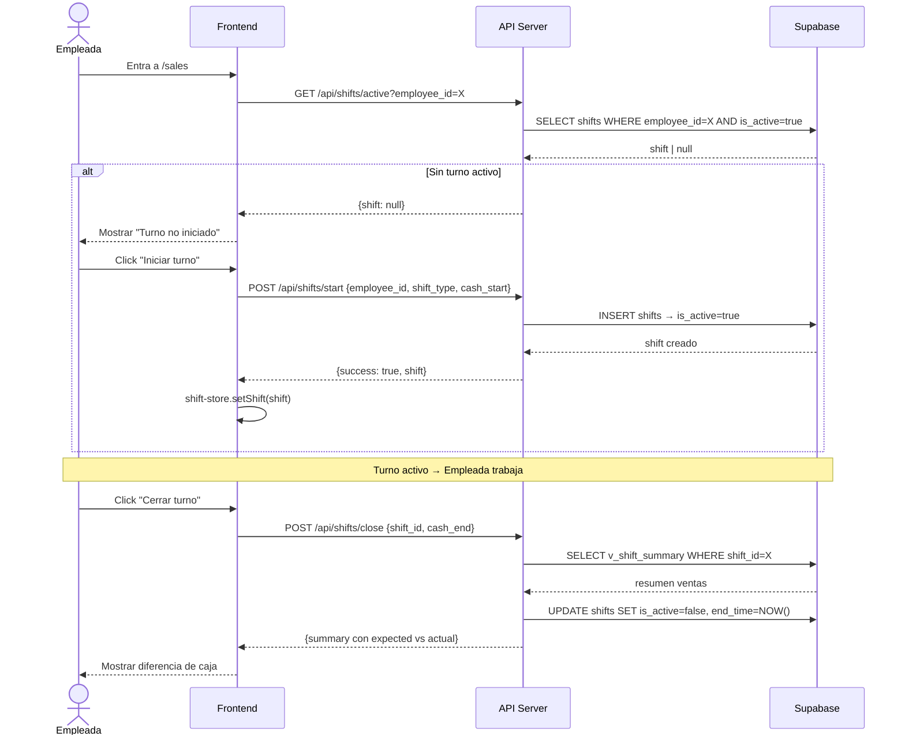
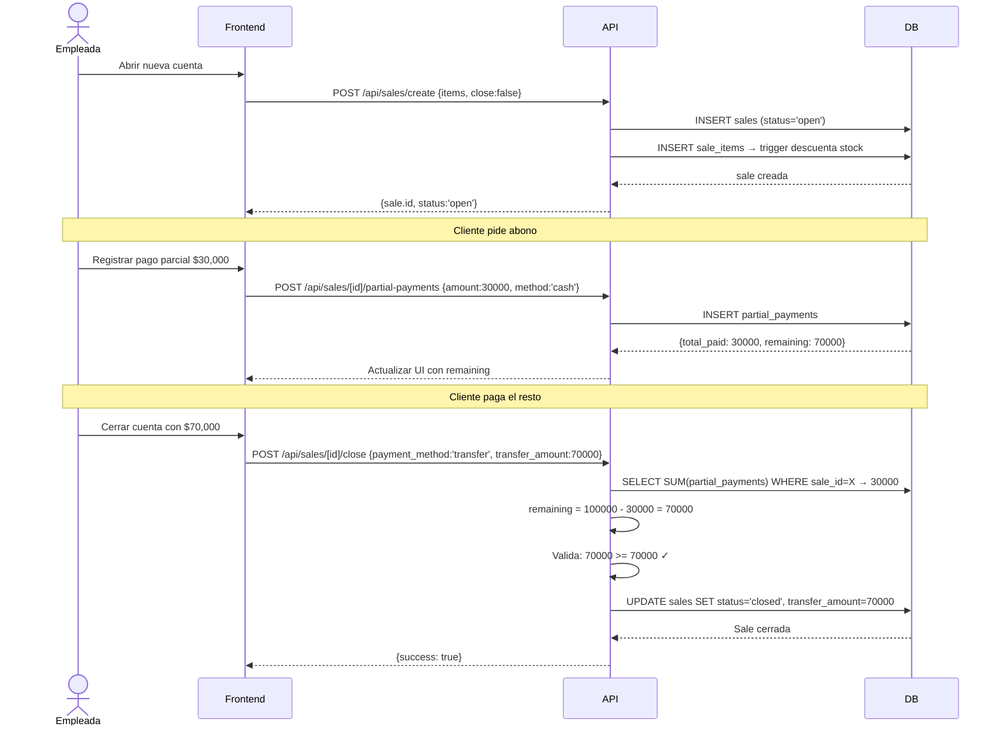

# DOCUMENTACIÓN TÉCNICA — UVALDAPP
## Sistema de Gestión de Ventas para Cervecería

> **Versión**: Marzo 2026
> **Stack**: Next.js 14 (App Router) · Supabase (PostgreSQL) · Zustand · TypeScript
> **Zona horaria**: Colombia UTC-5 (sin DST) · Día hábil: 6:00 AM → 5:59 AM siguiente día

---

## ÍNDICE

1. [Arquitectura General](#1-arquitectura-general)
2. [Base de Datos](#2-base-de-datos)
3. [Vistas (Views)](#3-vistas-views)
4. [API Endpoints](#4-api-endpoints)
5. [Stores (Estado Global)](#5-stores-estado-global)
6. [Páginas y Componentes](#6-páginas-y-componentes)
7. [Reglas de Negocio](#7-reglas-de-negocio)
8. [Diagrama de Flujos](#8-diagrama-de-flujos)
9. [Consideraciones Técnicas](#9-consideraciones-técnicas)

---

## 1. ARQUITECTURA GENERAL

```
┌─────────────────────────────────────────────────────────────────┐
│                        CLIENTE (Browser)                         │
│                                                                   │
│  ┌──────────────┐  ┌──────────────┐  ┌─────────────────────┐   │
│  │  auth-store  │  │  shift-store │  │     cart-store       │   │
│  │ (localStorage)│  │(localStorage)│  │   (en memoria)       │   │
│  └──────┬───────┘  └──────┬───────┘  └──────────┬──────────┘   │
│         │                  │                       │              │
│  ┌──────▼──────────────────▼───────────────────────▼──────────┐ │
│  │              Next.js App Router (Pages / Components)         │ │
│  └───────────────────────────┬─────────────────────────────────┘ │
└──────────────────────────────│──────────────────────────────────┘
                                │ fetch() a /api/...
┌──────────────────────────────▼──────────────────────────────────┐
│                      SERVIDOR (Next.js API)                       │
│                                                                   │
│  ┌─────────┐  ┌─────────┐  ┌──────────┐  ┌──────────────────┐  │
│  │  /auth  │  │ /shifts │  │  /sales  │  │ /reports/shifts  │  │
│  │  /login │  │ /start  │  │  /create │  │ /reports/cash    │  │
│  │  /logout│  │ /close  │  │  /close  │  │ /reports/ranking │  │
│  └─────────┘  │ /active │  │  /void   │  └──────────────────┘  │
│               │ /summary│  │  /[id]   │                          │
│               └─────────┘  └──────────┘                          │
│                                                                   │
│  ┌───────────────────────────────────────────────────────────┐  │
│  │  supabaseAdmin (service role → bypassa RLS)                │  │
│  └───────────────────────────┬───────────────────────────────┘  │
└──────────────────────────────│──────────────────────────────────┘
                                │ PostgreSQL / REST
┌──────────────────────────────▼──────────────────────────────────┐
│                          SUPABASE                                 │
│                                                                   │
│  Tablas · Vistas · Triggers · RLS · Índices                      │
└─────────────────────────────────────────────────────────────────┘
```

### Patrón de seguridad
- **Cliente anónimo** (`supabase` JS client): Bloqueado por RLS en tablas críticas. Solo se usa para autenticación.
- **`supabaseAdmin`** (service role key, solo servidor): Bypassa RLS. **TODOS** los endpoints de la API usan `supabaseAdmin`.
- **Autenticación**: Cookie HttpOnly `auth-token` (bcrypt + JWT/session de 12h).

---

## 2. BASE DE DATOS

### Diagrama Entidad-Relación



### Tablas en detalle

#### EMPLOYEES
| Columna | Tipo | Descripción |
|---|---|---|
| id | UUID PK | Identificador |
| name | VARCHAR(100) NOT NULL | Nombre completo |
| username | VARCHAR(50) UNIQUE NOT NULL | Usuario de login |
| password_hash | VARCHAR(255) NOT NULL | Contraseña bcrypt |
| role | employee_role | 'employee', 'owner', 'superadmin' |
| active | BOOLEAN DEFAULT true | Si está activo |

#### SHIFTS
| Columna | Tipo | Descripción |
|---|---|---|
| id | UUID PK | Identificador |
| employee_id | UUID FK → employees | Empleada del turno |
| type | shift_type | 'day' (6am-6pm) o 'night' (6pm-6am) |
| start_time | TIMESTAMPTZ DEFAULT NOW() | Inicio (UTC) |
| end_time | TIMESTAMPTZ nullable | Fin (null si activo) |
| cash_start | DECIMAL(10,2) DEFAULT 0 | Efectivo al iniciar |
| transfer_start | DECIMAL(12,2) DEFAULT 0 | Transferencias pendientes del turno anterior |
| cash_end | DECIMAL(10,2) nullable | Efectivo al cerrar |
| is_active | BOOLEAN DEFAULT true | Si está en curso |

#### SALES
| Columna | Tipo | Descripción |
|---|---|---|
| id | UUID PK | Identificador |
| employee_id | UUID FK | Empleada actual de la cuenta |
| shift_id | UUID FK | Turno donde se creó (NUNCA cambia) |
| total | DECIMAL | Total de la venta |
| status | sale_status | 'open', 'closed', 'voided' |
| table_number | VARCHAR(20) | Mesa o identificador |
| payment_method | payment_method nullable | null si aún no se paga |
| cash_amount | DECIMAL | Porción en efectivo |
| transfer_amount | DECIMAL | Porción en transferencia |
| opened_by_employee_id | UUID FK nullable | Quien abrió (no cambia) |
| taken_over_by_employee_id | UUID FK nullable | Quien tomó relevo |
| closed_by_employee_id | UUID FK nullable | Quien cerró |
| fiado_customer_name | VARCHAR nullable | Nombre cliente fiado |
| fiado_amount | DECIMAL DEFAULT 0 | Pendiente por cobrar |
| fiado_abono | DECIMAL DEFAULT 0 | Abono inicial |
| fiado_paid | BOOLEAN DEFAULT false | Si ya fue saldado |

#### INVENTORY
| Columna | Tipo | Descripción |
|---|---|---|
| quantity | INTEGER CHECK >= 0 | Stock ACTUAL del lote |
| initial_quantity | INTEGER | Stock al ingresar el lote |
| batch_date | DATE | Fecha del lote (para FIFO) |

**Trigger `tr_deduct_inventory`**: Al insertar `sale_items`, descuenta stock por **FIFO** (lote más antiguo primero). Si no hay stock suficiente, lanza excepción y falla la transacción.

**Trigger `tr_restore_inventory_on_delete`**: Al eliminar `sale_items`, restaura cantidad al lote más reciente del producto.

### Enums

```sql
employee_role:    'employee' | 'owner' | 'superadmin'
shift_type:       'day' | 'night'
payment_method:   'cash' | 'transfer' | 'mixed' | 'fiado'
sale_status:      'open' | 'closed' | 'voided'
product_category: 'beer_nacional' | 'beer_importada' | 'beer_artesanal' | 'other'
audit_action:     'CREATE' | 'UPDATE' | 'DELETE' | 'VOID' | 'CLOSE' | 'TAKEOVER' | 'ADD_ITEMS' | 'PRICE_CHANGE'
audit_entity:     'SALE' | 'SALE_ITEM' | 'INVENTORY' | 'PRODUCT' | 'COMBO'
```

---

## 3. VISTAS (VIEWS)

### v_open_tabs — Cuentas abiertas
```sql
Fuente: sales (WHERE status = 'open')
Campos clave:
  - id, table_number, total, created_at
  - employee_id, employee_name
  - opened_by_employee_id, opened_by_name
  - taken_over_by_employee_id, taken_over_by_name
  - total_paid: SUM(partial_payments.amount)
  - remaining: total - total_paid
  - items: JSON array [{id, product_id, product_name, quantity, unit_price,
                        subtotal, is_michelada, combo_id, added_by_name}]
```

### v_shift_summary — Resumen por turno
```sql
Fuente: shifts + sales + partial_payments
Campos clave:
  - shift_id, type, employee_name
  - cash_start, transfer_start, cash_end
  - cash_sales: SUM(cash_amount WHERE payment_method='cash')
  - transfer_sales: SUM(transfer_amount WHERE payment_method='transfer')
  - mixed_cash, mixed_transfer: partes del pago mixto
  - total_sales: SUM(total) ventas no anuladas
  - transactions_count: COUNT ventas cerradas no anuladas
  - open_tabs_count: COUNT ventas status='open'
  - is_active
```

### v_current_stock — Stock actual
```sql
Fuente: inventory GROUP BY product_id
Campos:
  - product_id, product_name, category, sale_price, min_stock
  - current_stock: SUM(quantity)
  - is_low_stock: current_stock <= min_stock
```

### v_fiados_pendientes — Fiados por cobrar
```sql
Fuente: sales WHERE payment_method='fiado' AND fiado_paid=false AND fiado_amount > 0
Orden: created_at DESC
```

### v_sale_audit_history — Historial de auditoría
```sql
Fuente: audit_logs JOIN employees
Orden: created_at DESC
```

### v_latest_inventory_counts — Último conteo por producto
```sql
DISTINCT ON (product_id) ORDER BY product_id, created_at DESC
```

---

## 4. API ENDPOINTS

### Mapa de rutas

```
/api/auth/
  POST  login              → Autenticar empleada
  POST  logout             → Cerrar sesión

/api/shifts/
  POST  start              → Iniciar turno
  POST  close              → Cerrar turno
  GET   active?employee_id → Turno activo de empleada
  GET   summary?shift_id   → Resumen de turno

/api/sales/
  GET   /                  → Historial de ventas
  POST  create             → Crear venta
  GET   [id]               → Detalle de venta
  POST  [id]/close         → Cerrar cuenta abierta
  POST  [id]/void          → Anular venta
  POST  [id]/add-items     → Agregar items a cuenta abierta
  POST  [id]/takeover      → Tomar relevo
  GET   [id]/partial-payments → Ver abonos
  POST  [id]/partial-payments → Registrar abono
  GET   open-tabs          → Cuentas abiertas

/api/products/
  GET   /                  → Lista con stock
  POST  /                  → Crear producto
  PUT   [id]               → Actualizar
  DELETE [id]              → Desactivar

/api/inventory/
  GET   /                  → Historial de lotes
  POST  /                  → Agregar lote
  GET   counts             → Conteos de inventario
  POST  counts             → Registrar conteo
  GET   counts/check?shift_id&employee_id → ¿Ya contó en este turno?

/api/employees/
  GET   /                  → Lista empleadas
  POST  /                  → Crear empleada
  PUT   [id]               → Actualizar empleada

/api/combos/
  GET   /                  → Lista combos con items
  POST  /                  → Crear combo
  PUT   [id]               → Actualizar combo

/api/observations/
  GET   /                  → Lista observaciones
  POST  /                  → Crear observación

/api/reports/
  GET   shifts?date=       → Reporte diario/rango/turno
  GET   employees          → Ventas por empleada
  GET   cash-audit         → Auditoría de caja
  GET   ranking            → Ranking de productos

/api/fiados/
  GET   /                  → Fiados pendientes
  POST  [id]/pay           → Cobrar fiado
```

### Endpoints críticos en detalle

#### POST /api/sales/create
```
Body requerido:
  employee_id: string
  shift_id: string
  items: [{product_id, quantity, unit_price, is_michelada?}]
  combos?: [{combo_id, final_price, items: [{product_id, quantity, is_michelada?}]}]
  close: boolean (default false)

Si close=true, también:
  payment_method: 'cash' | 'transfer' | 'mixed' | 'fiado'
  Para cash: cash_received, cash_change
  Para transfer: transfer_amount
  Para mixed: cash_amount, transfer_amount, cash_received, cash_change
  Para fiado: fiado_customer_name, fiado_amount, fiado_abono

Validaciones:
  ✓ Al menos 1 item o 1 combo
  ✓ Stock suficiente para todos los productos
  ✓ Si cash: cash_received >= total
  ✓ Si mixed: cash_amount + transfer_amount >= total
  ✓ Si fiado: fiado_customer_name no vacío

Status resultante:
  close=false → status='open'
  close=true  → status='closed'
```

#### POST /api/sales/[id]/close
```
IMPORTANTE: El monto a validar/cobrar es REMAINING, no TOTAL

Cálculo:
  total_partial_paid = SUM(partial_payments.amount)
  remaining = sale.total - total_partial_paid

Validación de pago:
  cash:     cash_received >= remaining
  transfer: transfer_amount >= remaining
  mixed:    cash_amount + transfer_amount >= remaining

Lo que se guarda como cash_amount/transfer_amount es la porción
del REMAINING, no del total original.

Ejemplo:
  total = $100,000
  pagos parciales previos = $30,000
  remaining = $70,000
  → se valida cash_received >= $70,000
  → cash_amount registrado = $70,000 (no $100,000)
```

#### GET /api/reports/shifts
```
Timezone: Colombia UTC-5
Día hábil:
  startOfDay = YYYY-MM-DD T 06:00:00 -05:00
  endOfDay   = YYYY-MM-DD+1 T 05:59:59 -05:00

Lógica de atribución de ventas:
  1. Busca turnos con start_time en el día hábil
  2. Si hay turnos → filtra ventas por shift_id IN (shiftIds)
  3. Si NO hay turnos → fallback a created_at en el rango
     (para datos históricos antes del fix de turnos)

Fuentes de totales del día:
  cash_sales +=
    sales con payment_method='cash' (cash_amount)
    + sales con payment_method='mixed' (cash_amount)
    + sales con payment_method='fiado' (fiado_abono)
    + SUM(partial_payments.cash_amount) de ventas del día
    + SUM(fiado_payments.cash_amount) cobrados en ese día

  transfer_sales +=
    sales con payment_method='transfer' (transfer_amount)
    + sales con payment_method='mixed' (transfer_amount)
    + SUM(partial_payments.transfer_amount) de ventas del día
    + SUM(fiado_payments.transfer_amount) cobrados en ese día
```

---

## 5. STORES (ESTADO GLOBAL)

### auth-store
```typescript
// Persistencia: localStorage key='auth-storage'
State {
  employee: Employee | null
  isAuthenticated: boolean
}
Actions {
  login(employee)
  logout()
}
Helpers {
  isOwner(role)     → role === 'owner' || role === 'superadmin'
  isSuperAdmin(role) → role === 'superadmin'
}
```

### shift-store
```typescript
// Persistencia: localStorage key='shift-storage'
State {
  currentShift: Shift | null
  cashRegister: {
    initialCash: number
    totalCash: number
    totalTransfer: number
    totalChange: number
  }
}
Actions {
  setShift(shift | null)
  clearShift()
  openCashRegister(initialCash)
  addCashSale(amount, change)
    → totalCash += (amount - change), totalChange += change
  addTransferSale(amount)
    → totalTransfer += amount
  addMixedSale(cashAmount, transferAmount, change)
    → totalCash += (cashAmount - change), totalTransfer += transferAmount
  resetCashRegister()
  getCashInRegister()
    → initialCash + cashSales - change
}

⚠️  IMPORTANTE: El store NO está separado por empleada.
    Si dos empleadas usan el mismo dispositivo, comparten el estado.
    Esto es conocido y aceptado por el negocio.
```

### cart-store
```typescript
// SIN persistencia (solo en memoria durante la sesión)
State {
  items: CartItem[]   // productos normales
  combos: CartCombo[] // combos
  total: number
}

MICHELADA_EXTRA = 4000 COP (precio adicional por michelada)

Clave de item: '{productId}-mich' | '{productId}-normal'
unit_price de michelada = sale_price + 4000

Actions: addItem, removeItem, updateQuantity, addCombo, removeCombo,
         updateComboPrice, clear
```

---

## 6. PÁGINAS Y COMPONENTES

### Rutas protegidas

```
/login                      → Pública
/(dashboard)/*              → Requiere auth (cookie válida)
  /                         → Dashboard
  /sales                    → Cuentas + Historial [ShiftGuard]
  /shifts/start             → Iniciar turno
  /shifts/close             → Cerrar turno
  /shifts/history           → Historial de turnos
  /inventory                → Inventario [owner/superadmin]
  /inventory/count          → Conteo de inventario
  /products                 → Productos [owner/superadmin]
  /combos                   → Combos [owner/superadmin]
  /employees                → Empleadas [owner/superadmin]
  /reports                  → Reportes [owner/superadmin]
  /fiados                   → Fiados [owner/superadmin]
  /audit                    → Auditoría [owner/superadmin]
  /observations             → Observaciones
  /admin                    → Admin [superadmin]
```

### ShiftGuard
```
Componente que envuelve páginas que requieren turno activo.

Excepciones:
  - owner y superadmin: pasan directamente (sin turno)
  - employee: requiere turno activo

Flujo para employee sin turno:
  → Muestra "Turno no iniciado" con botón a /shifts/start

Flujo para turno día sin conteo de inventario:
  → Muestra "Conteo de Inventario Requerido" con botón a /inventory/count
  (Si requireInventoryCount=true, que es el default)

Verificación: Llama a /api/shifts/active (NO al cliente Supabase, para evitar RLS)
```

---

## 7. REGLAS DE NEGOCIO

### 7.1 Ciclo de Turno



**Detección automática de tipo:**
- 6:00 AM - 5:59 PM Colombia → `day`
- 6:00 PM - 5:59 AM Colombia → `night`

**Turno stale (> 20 horas):**
- `/api/shifts/active`: filtra con `start_time >= NOW() - 20h`
- `/api/shifts/start`: si el turno activo tiene > 20h, lo cierra automáticamente y crea el nuevo

### 7.2 Flujo de Venta



### 7.3 Sistema de Pagos Parciales

```
Escenario: Cuenta de $100,000

1. Cliente abona $40,000 en efectivo
   → POST /api/sales/[id]/partial-payments
   → partial_payment: {amount: 40000, cash_amount: 40000}
   → total_paid: $40,000
   → remaining: $60,000

2. Cliente abona $20,000 en transferencia
   → POST /api/sales/[id]/partial-payments
   → partial_payment: {amount: 20000, transfer_amount: 20000}
   → total_paid: $60,000
   → remaining: $40,000

3. Cliente paga el resto ($40,000) en efectivo
   → POST /api/sales/[id]/close
   → payment_method: 'cash'
   → VALIDA: cash_received >= $40,000 (remaining)
   → cash_amount guardado: $40,000 (NO $100,000)
   → sale.status = 'closed'

En el reporte del turno:
   cash_sales = $40,000 (pago final) + $40,000 (parcial) = $80,000
   transfer_sales = $20,000 (parcial)
   total_sales = $100,000 (total original)
```

### 7.4 Lógica de Fiados

```
Crear fiado:
  payment_method = 'fiado'
  fiado_customer_name = "Juan Pérez" (requerido)
  fiado_amount = total - fiado_abono = $70,000 (pendiente)
  fiado_abono = $30,000 (paga hoy, cuenta como efectivo)
  fiado_paid = false

  → cash_sales del turno += $30,000 (el abono)
  → fiado_total del turno += $70,000 (pendiente)

Cobrar fiado después (otro día):
  POST /api/fiados/[id]/pay
  payment_method: 'cash' | 'transfer' | 'mixed'
  → Se registra en fiado_payments
  → fiado_paid = true (si queda saldado)

  → Ese cobro suma al día en que SE COBRA (no al día de la venta)
  → Aparece en reports como "pagos de fiados cobrados hoy"
```

### 7.5 Micheladas

```
Producto base: "Cerveza X" → sale_price = $5,000
Michelada:    "Cerveza X (Michelada)" → sale_price = $5,000 + $4,000 = $9,000

Constante: MICHELADA_EXTRA = 4,000 COP (definida en cart-store)

En sale_items:
  is_michelada = true
  unit_price = product.sale_price + 4000

En reportes:
  Se agrupa separado: "Cerveza X (Michelada)" vs "Cerveza X"
  Permite ver cuántas se vendieron en cada forma
```

### 7.6 Inventario FIFO

```
Cuando se vende 1 unidad del Producto A:
  1. Busca lotes del Producto A ordenados por batch_date ASC, created_at ASC
  2. Descuenta del lote más antiguo
  3. Si el lote tiene quantity=0, pasa al siguiente lote
  4. Si no hay stock suficiente: EXCEPCIÓN → falla la venta entera

Cuando se anula una venta:
  Para cada sale_item:
    1. Busca el lote más reciente del producto (batch_date DESC)
    2. Suma la cantidad devuelta a ese lote

Cuando se elimina un sale_item (edición):
  trigger tr_restore_inventory_on_delete:
    Misma lógica que anulación, para ese item específico
```

### 7.7 Roles y Permisos

| Acción | employee | owner | superadmin |
|---|:---:|:---:|:---:|
| Realizar ventas | ✓ | ✓ | ✓ |
| Ver cuentas abiertas | ✓ | ✓ | ✓ |
| Iniciar/cerrar turno | ✓ | ✓ | ✓ |
| Ver historial de ventas | ✓ | ✓ | ✓ |
| Anular ventas | ✗ | ✓ | ✓ |
| Ver reportes | ✗ | ✓ | ✓ |
| CRUD Productos | ✗ | ✓ | ✓ |
| CRUD Combos | ✗ | ✓ | ✓ |
| CRUD Empleadas | ✗ | ✓ | ✓ |
| Gestión Inventario | ✗ | ✓ | ✓ |
| Ver Fiados | ✗ | ✓ | ✓ |
| Auditoría | ✗ | ✓ | ✓ |
| Limpiar datos (admin) | ✗ | ✗ | ✓ |
| Pasar ShiftGuard sin turno | ✗ | ✓ | ✓ |

### 7.8 Timezone y Día Hábil

```
Colombia = UTC-5 (sin horario de verano, siempre fijo)

Día hábil:
  Inicio: YYYY-MM-DD T 06:00:00 -05:00  (6am Colombia = 11am UTC)
  Fin:    YYYY-MM-DD+1 T 05:59:59 -05:00 (5:59am Colombia día siguiente = 10:59am UTC)

Por qué 6am → 6am:
  Turno día:   6:00 AM - 5:59 PM  → todo dentro del día hábil ✓
  Turno noche: 6:00 PM - 5:59 AM  → también dentro del mismo día hábil ✓
  (Sin este ajuste, cierres a las 2am aparecerían en el día siguiente)

Implementación en código:
  startOfDay = `${date}T06:00:00-05:00`

  const [y, m, d] = date.split('-').map(Number);
  const next = new Date(y, m - 1, d + 1);
  endOfDay = `${nextDate}T05:59:59-05:00`

Aplica en:
  - GET /api/reports/shifts (getDailyReport, getDateRangeReport)
  - GET /api/sales (filtros start_date/end_date)
  - GET /api/reports/cash-audit

Fecha "hoy" por defecto en servidor:
  new Date(Date.now() - 5 * 60 * 60 * 1000).toISOString().split('T')[0]
  (Resta 5 horas al UTC para obtener fecha Colombia)

Fecha "hoy" en cliente:
  getLocalDate() → usa new Date().getDate() (timezone del navegador)
```

---

## 8. DIAGRAMA DE FLUJOS

### 8.1 Ciclo de Turno Completo



### 8.2 Flujo de Venta con Pagos Parciales



### 8.3 Atribución de Reportes por Turno

```
Timeline Colombia:

  Mar 27 6:00 AM ─────── Inicia turno DÍA ─────── Mar 27 5:59 PM
  Mar 27 6:00 PM ─────── Inicia turno NOCHE ────── Mar 28 3:00 AM → cierra

  Reporte del 27:
    Día hábil: Mar 27 6:00 AM → Mar 28 5:59 AM

    Busca shifts con start_time en ese rango:
      ✓ Turno DÍA (start: Mar 27 11:00 UTC = 6am Colombia) → shift_id = S1
      ✓ Turno NOCHE (start: Mar 27 23:00 UTC = 6pm Colombia) → shift_id = S2

    Busca ventas con shift_id IN [S1, S2]:
      ✓ Ventas del turno día
      ✓ Ventas del turno noche (incluyendo cierres a las 3am del 28)
      ✗ NO incluye ventas del turno siguiente

  Reporte del 28:
    Día hábil: Mar 28 6:00 AM → Mar 29 5:59 AM

    Busca shifts con start_time entre esos horarios:
      ✓ Solo los turnos que EMPEZARON el 28
      ✗ NO el turno noche del 27 (que empezó el 27)

    → Si no hubo ventas el 28, el reporte muestra $0 ✓
```

---

## 9. CONSIDERACIONES TÉCNICAS

### 9.1 Puntos críticos (fuentes de bugs)

| Área | Riesgo | Mitigación actual |
|---|---|---|
| RLS Supabase | Cliente anónimo bloqueado | Todos los endpoints usan `supabaseAdmin` |
| Timezone | UTC vs Colombia (-5h) | Offset `-05:00` en todas las queries de fecha |
| Día hábil | Turno noche cruce de medianoche | Inicio 6am, fin 5:59am siguiente día |
| Shift-store | Compartido entre dispositivos/empleadas | Aceptado, un dispositivo por empleada |
| Pagos parciales | Validar contra remaining, no total | POST /close calcula remaining antes de validar |
| FIFO inventario | Orden de descuento | Trigger PG por batch_date ASC |
| Stale shifts | Turno abierto por días | Auto-cierre si > 20 horas |

### 9.2 Migraciones (orden)

```
001_initial_schema.sql        → Tablas base, enums, triggers
002_mixed_payments.sql        → Soporte pago mixto
002b_mixed_payment_views.sql  → Vistas para mixto
003_combos.sql                → Combos y combo_items
004_open_tabs.sql             → Cuentas abiertas (sale status)
005_handoff_improvements.sql  → Tracking de traspaso
006_fiados.sql                → Sistema de fiados
007_audit_logs.sql            → Tabla de auditoría
008_inventory_counts.sql      → Conteos de inventario
009_observations.sql          → Observaciones de turno
010_product_suppliers.sql     → Relación producto-proveedor
011_sale_items_tracking.sql   → added_by en items
012_partial_payments.sql      → Pagos parciales
013_observations_v2.sql       → Mejoras observaciones
014_inventory_counts_v2.sql   → Mejoras conteos
015_fiado_payments.sql        → Pagos de fiados posteriores
016_fix_shift_summary.sql     → Fix vista v_shift_summary
017_fiado_payments_v2.sql     → Mejoras tabla fiado_payments
```

### 9.3 Variables de entorno necesarias

```env
NEXT_PUBLIC_SUPABASE_URL      → URL del proyecto Supabase
NEXT_PUBLIC_SUPABASE_ANON_KEY → Clave anónima (cliente)
SUPABASE_SERVICE_ROLE_KEY     → Clave service role (solo servidor, bypassa RLS)
```

### 9.4 Archivos clave

```
src/
├── app/
│   ├── api/                    → Todos los endpoints del servidor
│   │   ├── auth/login          → Autenticación bcrypt
│   │   ├── shifts/             → Ciclo de turnos
│   │   ├── sales/              → Ventas y cuentas
│   │   └── reports/shifts/     → Reportes (lógica timezone aquí)
│   └── (dashboard)/            → Páginas del cliente
├── components/
│   └── shift-guard.tsx         → Guardia de turno (owners pasan siempre)
├── stores/
│   ├── auth-store.ts           → Estado de autenticación
│   ├── shift-store.ts          → Estado del turno activo
│   └── cart-store.ts           → Carrito temporal
├── lib/
│   ├── supabase/
│   │   ├── client.ts           → Cliente anónimo (solo auth)
│   │   └── server.ts           → supabaseAdmin (service role)
│   └── utils.ts                → formatCurrency, getLocalDate, detectShiftType
└── types/
    └── database.ts             → Interfaces TypeScript
```

---

*Documento generado automáticamente del código fuente — Marzo 2026*
